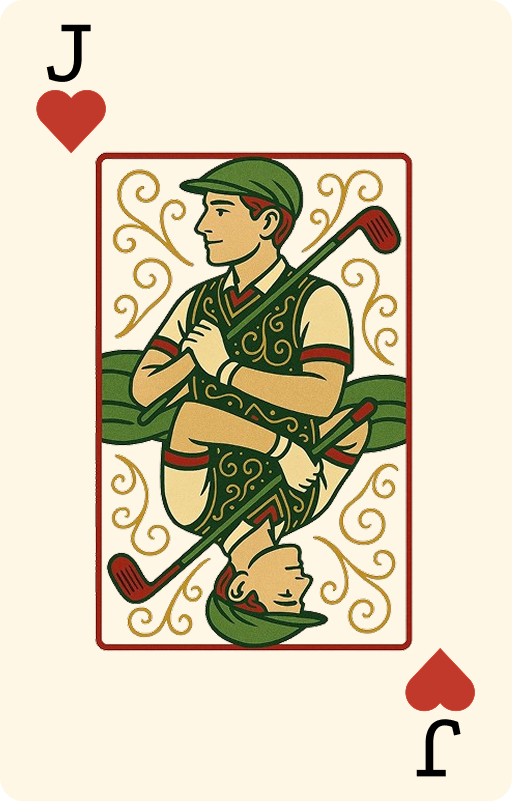
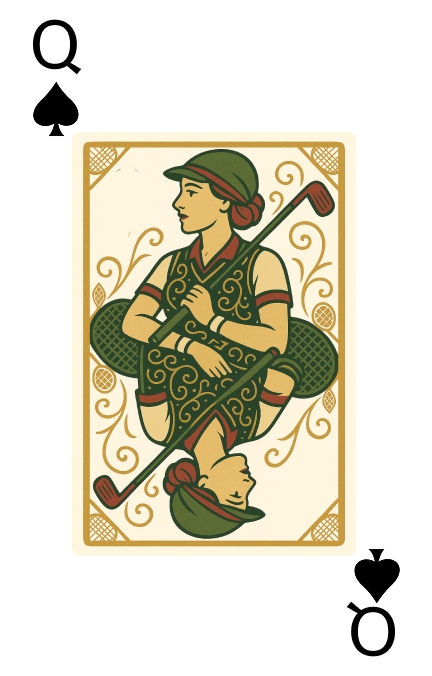
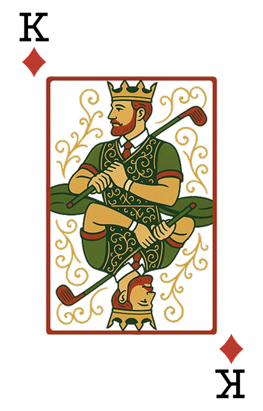
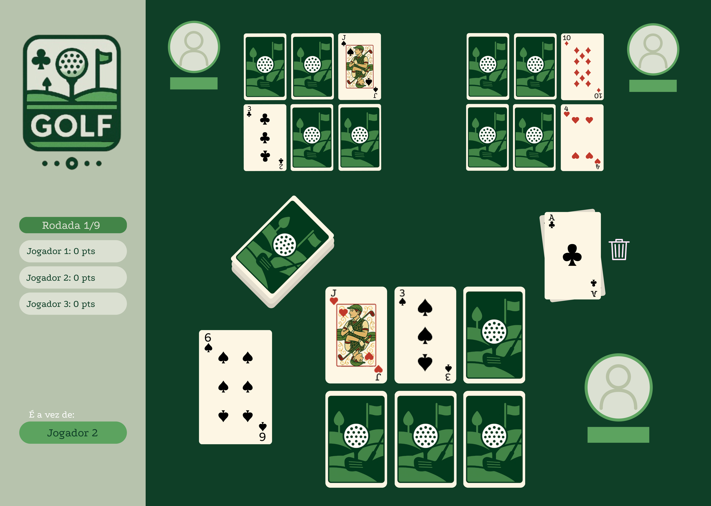

<h1> Golf — Jogo de Cartas</h1>

Projeto da disciplina INE5417 — Engenharia de Software I  
Universidade Federal de Santa Catarina (UFSC)  
Professor: Ricardo Pereira e Silva  
Semestre: 2025.1

Desenvolvido pelos alunos do curso de Ciência da Computação:

- Juliana Miranda Bosio  
- Lucas Furlanetto Pascoali  
- Vinícios Rosa Buzzi


<p align="center">
  
  
  
</p>


## Descrição

Este repositório contém o projeto completo do jogo de cartas [**Golf**](https://en.wikipedia.org/wiki/Golf_(card_game)), desenvolvido como trabalho prático da disciplina de Engenharia de Software I. O jogo foi implementado em Python, utilizando programação orientada a objetos e interface gráfica com Tkinter. Também foi utilizado o **DOG server**, disponibilizado pelo professor, para suporte ao desenvolvimento em arquitetura cliente-servidor. O design da interface foi elaborado no [**Figma**](https://www.figma.com/design/EnUrm9LLCyUdfDpl5b5v4D/Golf?node-id=0-1&t=dzQt8U1KGsWmDuli-1), com auxílio do ChartGPT para criação das ilustrações.

O jogo [**Golf**](https://en.wikipedia.org/wiki/Golf_(card_game)) é uma variação de jogos de cartas de baixa pontuação. Cada jogador possui uma grade de cartas viradas para baixo e, ao longo das rodadas, deve substituir cartas e tentar manter os menores valores possíveis. O jogo termina após todas as cartas estarem viradas, e o vencedor é quem tiver a menor pontuação.

<p align="center">
  
  <br>
  <em>Figura 1: Interface principal do jogo Golf.</em>
</p>

## Como Executar

1. Clone o repositório:
   ```bash
   git clone https://github.com/lucasfpascoali/Golf-CardGame.git
   cd Golf-CardGame
   ```

2. Crie um ambiente virtual:
    ```bash
    python3 -m venv venv
    source venv/bin/activate
   ```

3. Instale as dependências:
    ```bash
    pip install -r requirements.txt
   ```

4. Navegue até a pasta do código-fonte:
    ```bash
    cd src
   ```

5. Execute o programa:
    ```bash
    python3 main.py
   ```

## Documentação do Projeto

A pasta do projeto inclui:

- `Golf.vpp`: arquivo do **Visual Paradigm** contendo:
  - Diagrama de Casos de Uso
  - Diagramas de Classes
  - Diagramas de Atividades
  - Diagramas de Estados
  - Diagramas de Sequência
  - Diagramas de Algoritmo


- `Requisitos.pdf`: documento com a especificação dos requisitos funcionais e não funcionais do sistema.
